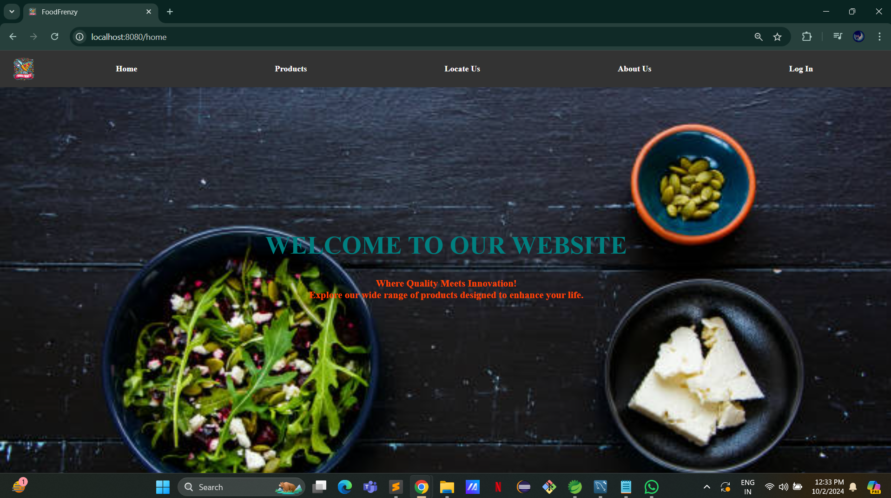
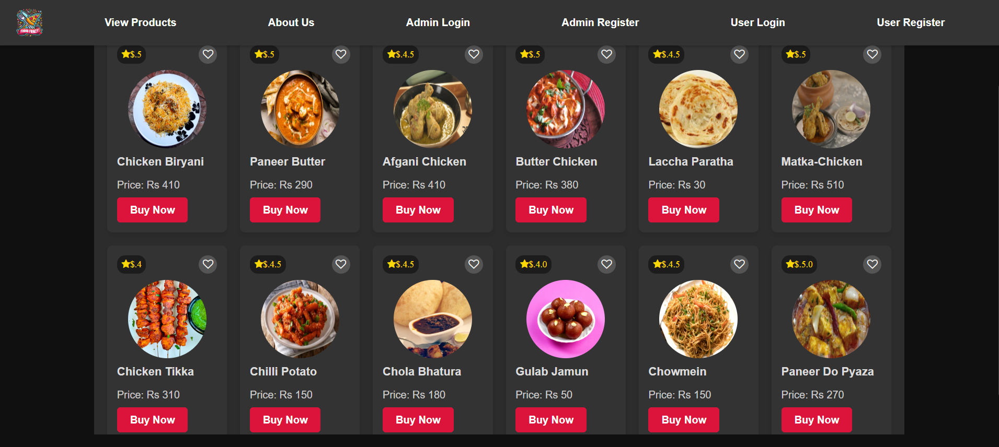
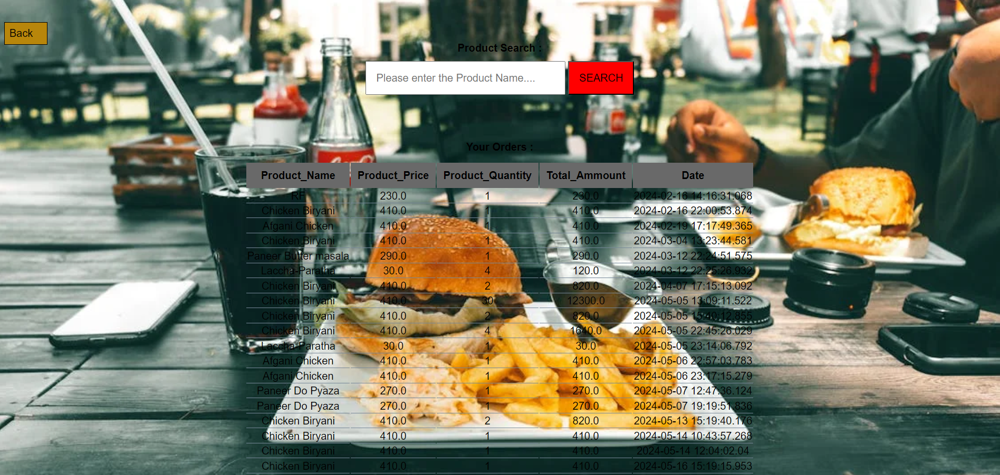
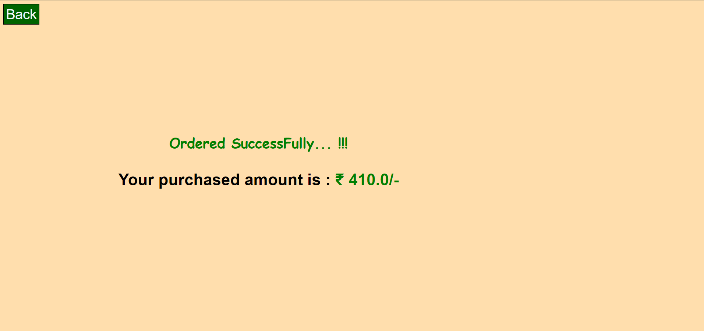
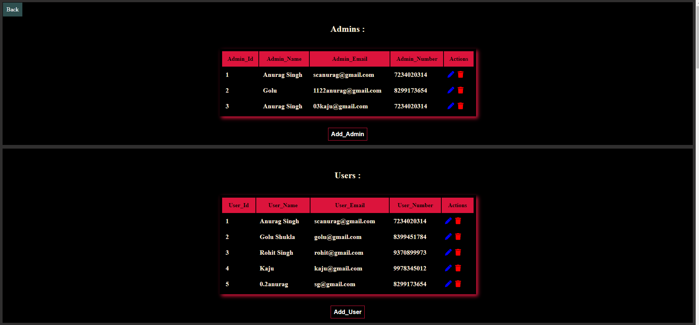
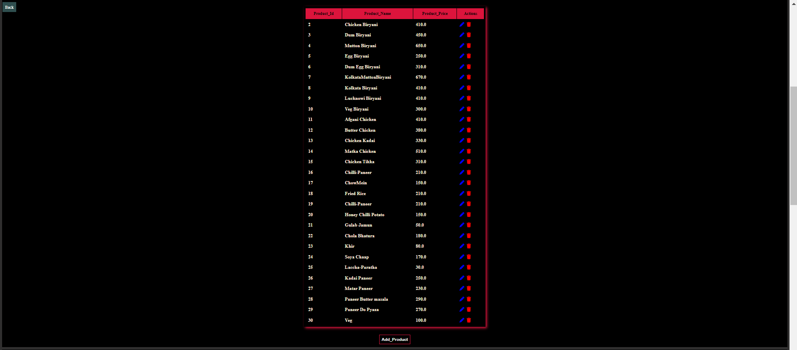
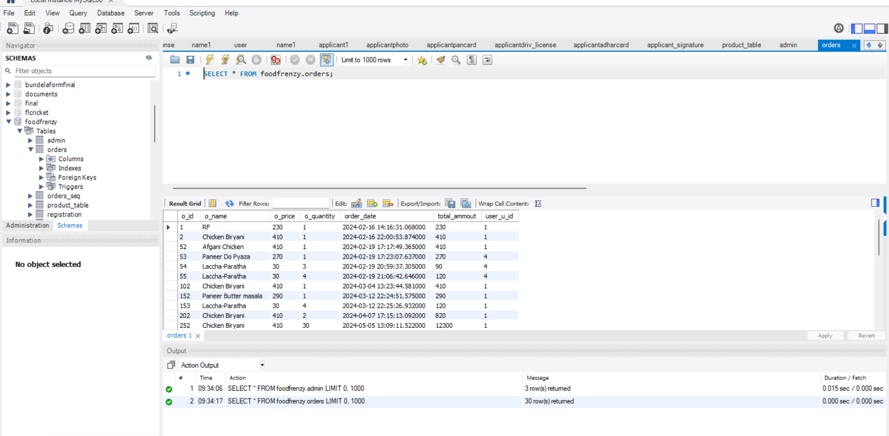

# FoodFrenzy

FoodFrenzy is a Spring Boot web application for food ordering and admin management. It uses Thymeleaf for server-side rendered pages and MySQL for persistence.




## Tech Stack

- Java 17
- Spring Boot 3.1.3
- Spring MVC + Thymeleaf
- Spring Data JPA (Hibernate)
- Spring Security
- MySQL
- Maven Wrapper (`mvnw`, `mvnw.cmd`)

## Project Structure

```text
src/main/java/com/example/demo/
    config/
    controllers/
    entities/
    repositories/
    services/
    FoodFrenzyApplication.java

src/main/resources/
    application.properties
    static/
    templates/
```


screenshots















## Prerequisites

- JDK 17+
- MySQL 8+

## Configuration

Update database settings in `src/main/resources/application.properties`:

```properties
spring.datasource.name=FoodFrenzy
spring.datasource.url=jdbc:mysql://localhost:3306/FoodFrenzy?createDatabaseIfNotExist=true
spring.datasource.username=root
spring.datasource.password=root
spring.datasource.driver-class-name=com.mysql.cj.jdbc.Driver
spring.jpa.hibernate.ddl-auto=update
```

## Run the Application

On Windows (PowerShell / CMD):

```bash
./mvnw.cmd spring-boot:run
```

On macOS/Linux:

```bash
./mvnw spring-boot:run
```

App URL:

- `http://localhost:8080`

## Build and Test

Build:

```bash
./mvnw clean package
```

Run tests:

```bash
./mvnw test
```

## Notes

- The database schema is auto-managed with `spring.jpa.hibernate.ddl-auto=update`.
- Static assets are under `src/main/resources/static`.
- Thymeleaf templates are under `src/main/resources/templates`.
